Programas de ordenador
======================
Los programas de ordenador tales como los programas Python o las macros
makefile se distribuyen por defecto bajo licencia GPL v3. 

La página web y sus ficheros en JavaScript están basados, con cambios, 
en el proyecto de James Q. Quick
https://github.com/jamesqquick/Build-A-Quiz-App-With-HTML-CSS-and-JavaScript
con licencia [MIT](https://github.com/jamesqquick/Build-A-Quiz-App-With-HTML-CSS-and-JavaScript/blob/master/LICENSE).

Texto de los cuestionarios
==========================
Autores de los cuestionarios:
 - Carlos Pardo
 - [Tucho Méndez](https://github.com/procastino/bancosTecno)

El texto de los cuestionarios en los archivos .yaml (preguntas y opciones de respuesta) 
se distribuyen bajo licencia Creative Commons CC0 1.0 Universal
o bajo licencia Creative Commons Attribution-ShareAlike 4.0.
Cada uno de los archivos tiene en las primeras líneas de la cabecera 
información sobre la licencia con la que se distribuyen.

Se puede leer el texto de la licencia CC0 en el enlace: https://creativecommons.org/publicdomain/zero/1.0/deed.es_ES

Se puede leer el texto de la licencia CC BY-SA 4.0 en el enlace: https://creativecommons.org/licenses/by-sa/4.0/deed.es

Imágenes del proyecto
=====================
Las imágenes de los cuestionarios se distribuyen bajo diferentes 
licencias. Por defecto la licencia de las imágenes será 
**Creative Commons CC BY-SA 4.0 International** a menos que se indique 
lo contrario.

Las siguientes imágenes creadas por Carlos Pardo y que se pueden encontrar 
en el repositorio  https://github.com/picuino/questionary
se distribuyen bajo **licencia Creative Commons Attribution-ShareAlike 4.0**.
Se puede leer el texto de la licencia en el enlace: https://creativecommons.org/licenses/by-sa/4.0/deed.es

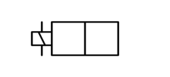

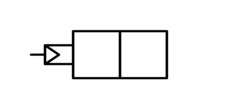
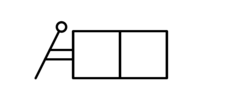
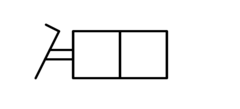

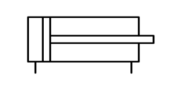

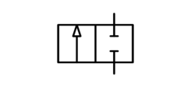
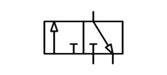

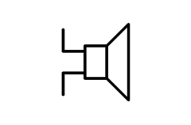

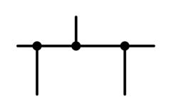
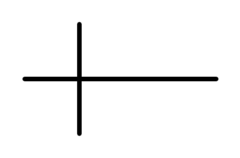
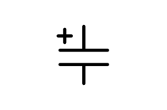
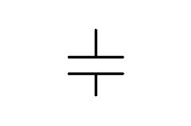

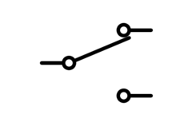
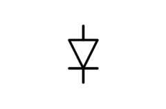
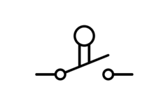

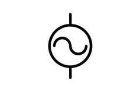

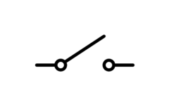
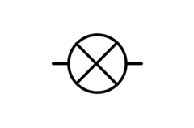
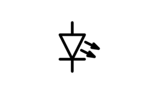
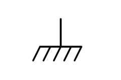

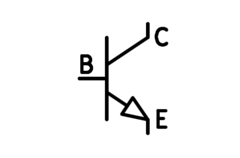
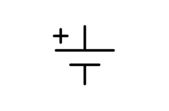
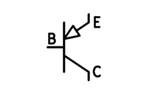

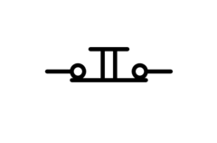
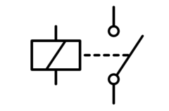
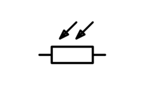
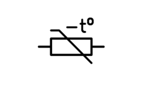
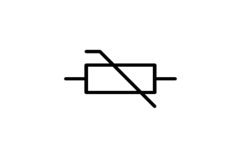
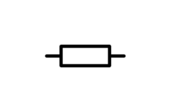
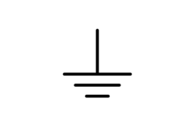

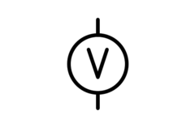

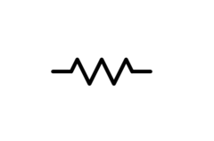
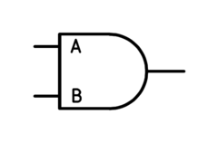

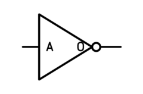
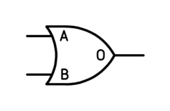
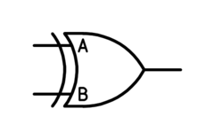
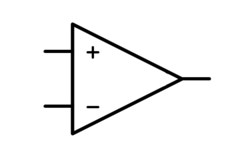
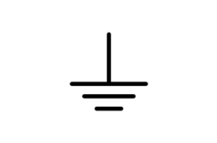

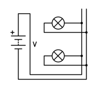
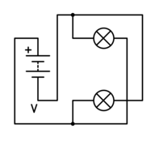
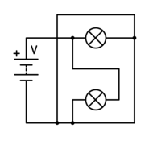
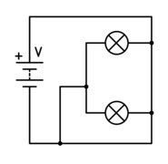
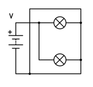
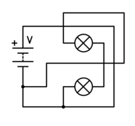
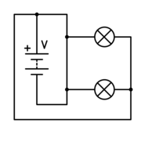

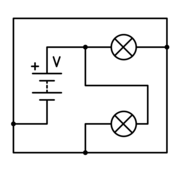
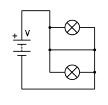
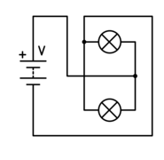
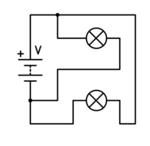
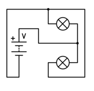

Las siguientes imágenes creadas por Tucho Méndez y que se pueden encontrar 
en el repositorio https://github.com/procastino/bancosTecno
se distribuyen bajo **licencia Creative Commons CC0 1.0 Universal**
(bajo Dominio Público).
Se puede leer el texto de la licencia en el enlace: https://creativecommons.org/publicdomain/zero/1.0/deed.es_ES

Imágenes Externas
=====================

Las siguientes imágenes están tomadas de **wikimedia**.
Cada una de ellas tiene un enlace a la página de donde fueron tomadas y 
un título con el autor y la licencia.

